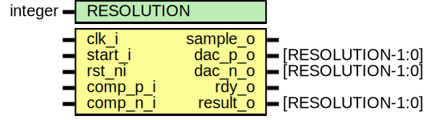
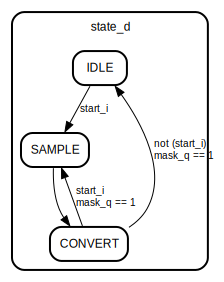

# Entity: adc 
- **File**: adc.sv

## Diagram

## Generics

| Generic name | Type    | Value | Description            |
| ------------ | ------- | ----- | ---------------------- |
| RESOLUTION   | integer | 8     | ADC resolution in bits |

## Ports

| Port name | Direction | Type             | Description                                 |
| --------- | --------- | ---------------- | ------------------------------------------- |
| clk_i     | input     |                  | Clock input                                 |
| start_i   | input     |                  | Start signal for ADC conversion             |
| rst_ni    | input     |                  | Active low reset signal                     |
| comp_p_i  | input     |                  | Positive side comparator input              |
| comp_n_i  | input     |                  | Negative side comparator input              |
| sample_o  | output    |                  | Sample signal indicating ADC is sampling    |
| dac_p_o   | output    | [RESOLUTION-1:0] | Positive Digital-to-Analog Converter output |
| dac_n_o   | output    | [RESOLUTION-1:0] | Negative Digital-to-Analog Converter output |
| rdy_o     | output    |                  | Ready signal indicating conversion is done  |
| result_o  | output    | [RESOLUTION-1:0] | Result of the ADC conversion                |

## Signals

| Name  | Type  | Description                                    |
| ----- | ----- | ---------------------------------------------- |
| comp  | logic | Comparator output: high when vip > vin         |
| rdy_q | logic | Ready signal indicating conversion is complete |
| rdy_d | logic | Ready signal indicating conversion is complete |

## Types

| Name    | Type                                                                                                                                                                                                  | Description                           |
| ------- | ----------------------------------------------------------------------------------------------------------------------------------------------------------------------------------------------------- | ------------------------------------- |
| state_t | enum logic [1:0] {               IDLE,              SAMPLE,              CONVERT           } | State machine states                  |
| data_t  | logic [RESOLUTION-1:0]                                                                                                                                                                                | Data type for DAC outputs and results |

## Processes
- combinational_sar_logic: (  )
  - **Type:** always_comb
  - **Description**
 Combinational logic for SAR ADC 

## State machines

